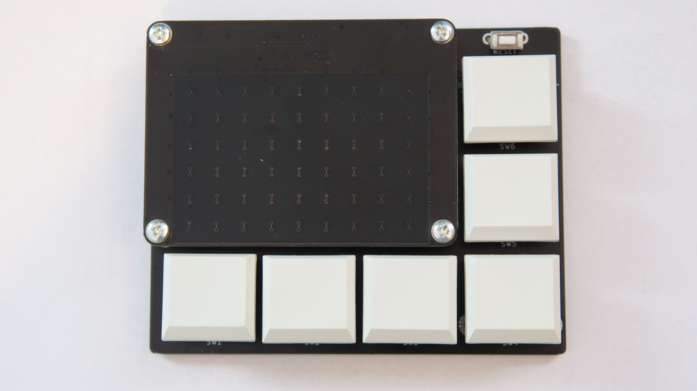
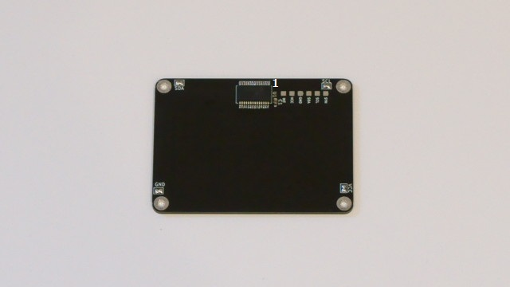
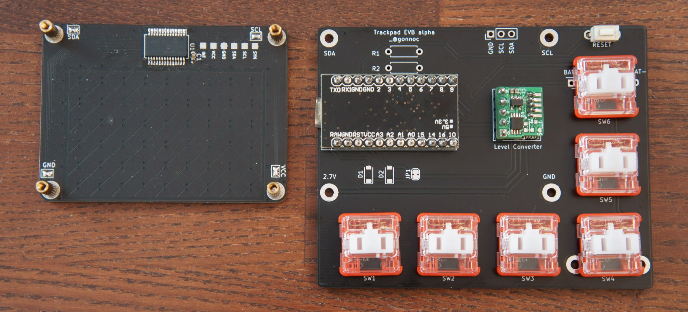

# トラックパッドIC(MTCH6102)評価用基板



- [Toybox Keyboard](https://nogikes.booth.pm/items/2091598)の右上に搭載しているトラックパッドを搭載したマクロパッドです  
- トラックパッド付き自作キーボードの実験ができます

## トラックパッドの仕様
- 検出
  - シングルタッチ
  - タップ、ダブルタップ
- サイズ
  - 基板:60x44[mm]
  - 検出部:50x33[mm]
- 分解能
    - 576x384

## キット内容

| 部品                       | 数量    |
| -------------------------- | ------- |
| トラックパッド基板         | 1       |
| メイン基板                 | 1       |
| レベル変換基板             | 1       |
| トラックパッドIC(MTCH6102) | 1       |
| 積層セラミックコンデンサ   | 1       |
| リセットスイッチ           | 1       |
| ピンヘッダ                 | 1セット |
| スペーサー                 | 4       |
| ネジ                       | 8       |
| ゴム足                     | 4       |

## キット以外に必要な部品

| 部品                       | 数量    |
| -------------------------- | ------- |
| Pro Micro                  | 1       |
| コンスルーまたはピンヘッダ | 1セット |
| スイッチ(Choc推奨)         | 6       |
| キーキャップ               | 6       |

## ビルドガイド

### トラックパッド基板をハンダ付けする
- IC, コンデンサをハンダ付けします
- 4隅のジャンパをブリッジさせてネジ取り付け用のスルーホールを導通させます



### レベル変換基板とスイッチをはんだ付けする



### トラックパッドとキーキャップをつける
- トラックパッドとメイン基板をスペーサーとネジで止めます
- キースイッチにキーキャップをつけてゴム足を貼り付けたら完成です

### プログラムを書き込む
- [https://github.com/sekigon-gonnoc/qmk_firmware/tree/dev/sekigon/keyboards/keyboards/sekigon/tp1s6](https://github.com/sekigon-gonnoc/qmk_firmware/tree/dev/sekigon/keyboards/keyboards/sekigon/tp1s6)

  ```bash
    make sekigon/tp1s6:default:flash
  ```