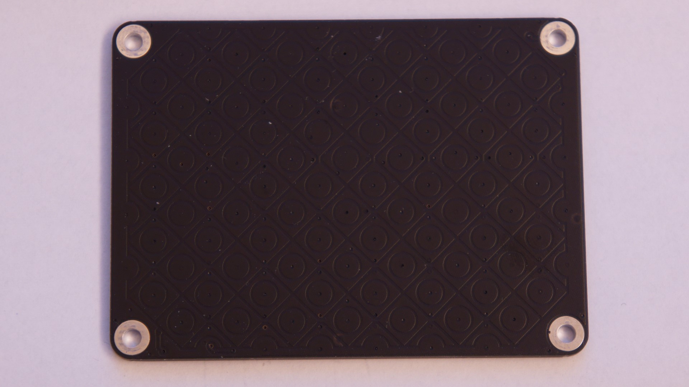
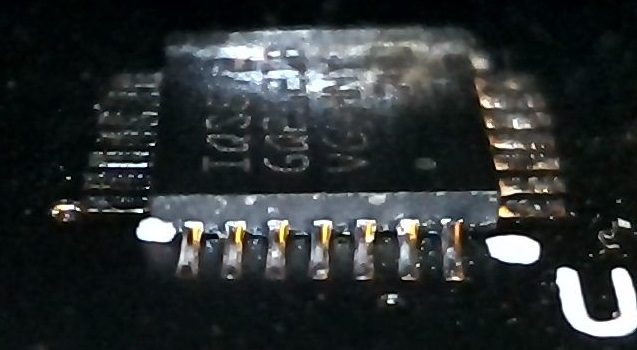
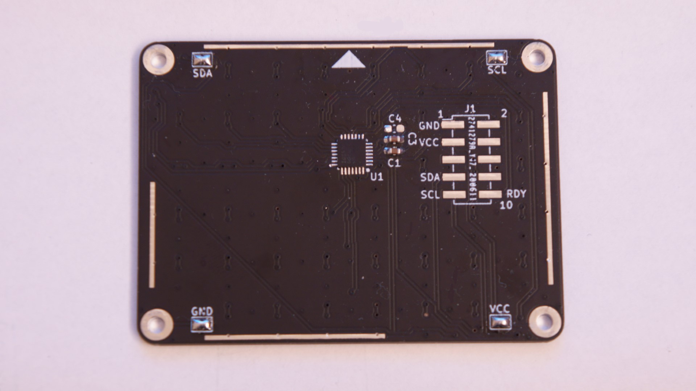

# トラックパッドIC(MTCH6102)評価用基板

||
|-|-|
|メイン基板+シングルタッチ基板|マルチタッチ基板|
- [Toybox Keyboard](https://nogikes.booth.pm/items/2091598)の右上に搭載しているトラックパッドを搭載したマクロパッドです  
- トラックパッド付き自作キーボードの実験ができます

## 販売リンク
- [BOOTH](https://nogikes.booth.pm/items/2712507)

## トラックパッドの仕様
### MTCH6102
- 検出
  - 1点
  - タップ、ダブルタップ
- サイズ
  - 基板:60x44[mm]
  - 検出部:50x33[mm]
- 分解能
    - 576x384

### IQS572
- 検出
  - 2点
  - タップ、ダブルタップ、各種ジェスチャ(ソフトウェアの処理による)
- サイズ
  - 基板:60x44[mm]
  - 検出部:55x41[mm] (*四隅のパッド部分は除く)
- 分解能
    - 1792x1280

## キット内容

### 本体

| 部品                       | 数量    |
| -------------------------- | ------- |
| トラックパッド基板(シングルタッチ版)         | 1       |
| メイン基板                 | 1       |
| レベル変換基板             | 1       |
| トラックパッドIC(MTCH6102) | 1       |
| 積層セラミックコンデンサ   | 1       |
| リセットスイッチ           | 1       |
| ピンヘッダ                 | 1セット |
| スペーサー                 | 4       |
| ネジ                       | 8       |
| ゴム足                     | 4       |

### マルチタッチ対応オプション基板
| 部品                       | 数量    |
| -------------------------- | ------- |
| トラックパッド基板(マルチタッチ版)         | 1       |
| トラックパッドIC(IQS572) | 1       |
| 積層セラミックコンデンサ(1uF)   | 2       |

## キット以外に必要な部品

| 部品                       | 数量    |
| -------------------------- | ------- |
| Pro Micro                  | 1       |
| コンスルーまたはピンヘッダ | 1セット |
| スイッチ(Choc推奨)         | 6       |
| キーキャップ               | 6       |
| スマホ用の液晶保護フィルムなど(マルチタッチ版には必須)               | 1       |

## ビルドガイド

### トラックパッド基板をハンダ付けする
#### シングルタッチ版の場合
- IC, コンデンサをハンダ付けします
- 4隅のジャンパをブリッジさせてネジ取り付け用のスルーホールを導通させます
  - バージョンによっては初期状態で導通しているのでこの手順は不要です


#### マルチタッチ版の場合
- IC, コンデンサ(C1, C3)をはんだ付けします
  - QFNを手ハンダする必要があります
    - QFNの側面と底面に露出しているパッドが一体となっていて、底面中央部にパッドがないタイプなので、QFNとしては手ハンダしやすいです
    - 図のようにQFNの側面パッドとランドがハンダでついていることを確認してください 
    
    
- 4隅のジャンパは初期状態で導通しているのでブリッジさせる必要はありませｎ
- スマホの液晶シートなどを表面に貼り付けてください
  - シングルタッチ版と違い何かしらのシートがないと正しく読み取れません

### レベル変換基板とスイッチをはんだ付けする


### トラックパッドとキーキャップをつける
- Pro Microを裏向きに取り付けます
- トラックパッドとメイン基板をスペーサーとネジで止めます
  - メイン基板のネジ穴付近のシルク印刷が間違っていますが、接続は問題ありません。正しくは右上がSDA, 左上がSCLです。
- キースイッチにキーキャップをつけてゴム足を貼り付けたら完成です

### Pro Microプログラムを書き込む
- QMK Toolboxや[ProMicro Web Updater](https://sekigon-gonnoc.github.io/promicro-web-updater/)を使って書き込む場合は[Relaseページ](https://github.com/sekigon-gonnoc/tp1s6-doc/releases/tag/0.2)にあるビルド済みのHEXファイルを使用してください
- QMKのリポジトリとフォルダは下記のとおりです
  - [https://github.com/sekigon-gonnoc/qmk_firmware/tree/dev/sekigon/keyboards/sekigon/tp1s6](https://github.com/sekigon-gonnoc/qmk_firmware/tree/dev/sekigon/keyboards/sekigon/tp1s6)
- マルチタッチ版の組立の場合、まずはトラックパッドICのファームウェアを書き換えるためにPro Microにはbootloaderキーマップを書き込んでください
  ```bash
    # シングルタッチ版の場合
    make sekigon/tp1s6:default:flash
    # マルチタッチ版, 組立時の場合
    make sekigon/tp1s6:bootloader:flash
    # マルチタッチ版, 通常運用の場合
    make sekigon/tp1s6:default:flash TP=iqs
  ```

### (マルチタッチ版のみ)トラックパッドICのファームウェア書き込み
#### 基板の配線
- メイン基板がalpha版(2021年3月より前に購入したもの)の場合は、最初にトラックパッドICに書き込む際に、一度Pro Microをメイン基板から取り外し、別途ブレッドボードやジャンパワイヤを使ってメイン基板に配線する必要があります
  - 2回目以降の書き換えが必要になった場合はそのままメイン基板に取り付けた状態で書き換え可能です
  - Pro MicroのSDA(2), SCL(3), GND(いずれか1つ)はメイン基板の対応する位置にそのまま配線してください
  - Pro MicroのF4(A3)はメイン基板のVCCに対応する位置に配線してください(A3からUSBコネクタ側に1個ずらして配線)
    - トラックパッドのリセットタイミングを制御するため、GPIOからトラックパッドに電源供給しています
- メイン基板がbeta版以降の場合は初回からPro Microを取り付けた状態で書き込めます

#### ファームの書き込み
- Google Chromeから[CH559 Web Updater](https://sekigon-gonnoc.github.io/ch559-web-updater/)にアクセスしてください
- Bootloaderキーマップが書き込まれたPro MicroをPCに接続し、flashボタンをクリックしてPro Microのポートを選択して書き込みを開始します
  - **書き込み中はPro Microを抜いたりブラウザを閉じたりしないでください** 
- 書き込みが完了したらdefaultキーマップに書き換えて動作確認してください

### ジェスチャ認識
- マルチタッチ版では下記のジェスチャ操作ができます

 |ジェスチャ|動作|
 |-|-|
 |1点タップ|左クリック|
 |2点タップ|右クリック|
 |2本指スワイプ|上下左右スクロール|
 |ピンチイン/アウト|拡大(Ctrl + =)/縮小(Ctrl + -)|
 |1点タッチの状態でもう1点タップ|ドラッグモードへ|
 |ドラッグモード中にタップ|通常モードへ|

 ドラッグモードでは指を離した状態でも左クリックが継続します
